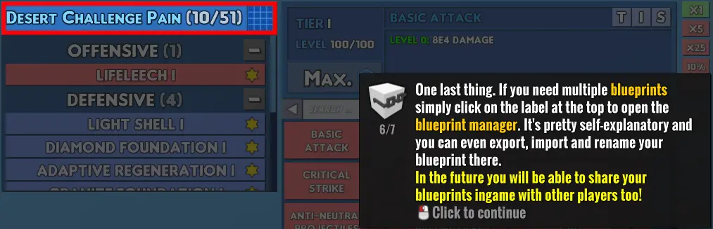
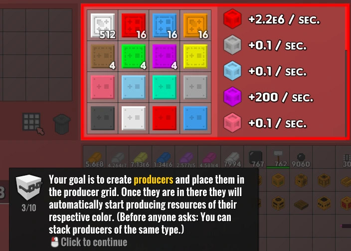
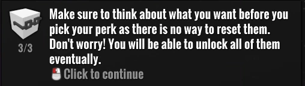
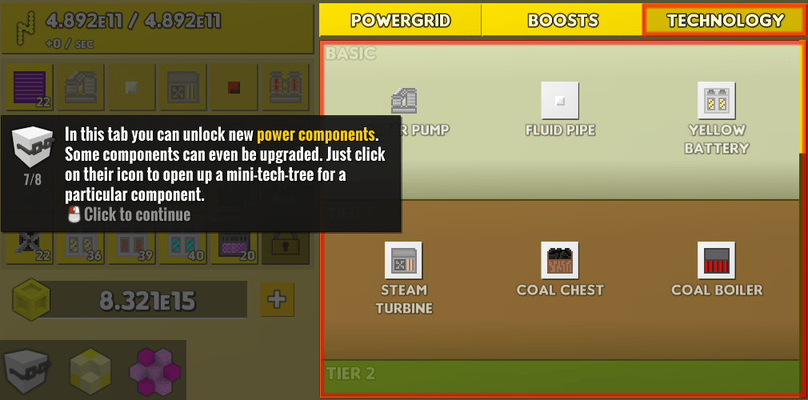
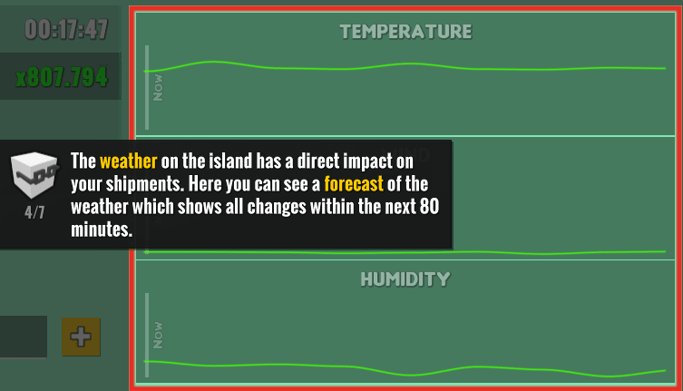

Listed below will be several frequently asked questions that are answered in the in-game tutorials. If you know anything frequently asked that is explained in-game somewhere please tell me. These are not sorted in the order of how commonly I see them; they are just in whatever order I feel like putting them in.

## How do I import/export/rename/save my blueprint?

## Do producers stack?

## How do/Can I reset my military perks?

## Why does my powerplant have less power/produce less power than the design pinned in [⁠mt-2-to-5](https://discord.com/channels/488444879836413975/781517590123905064/855970304631636012)

## How long is the weather forecast in the shipyard?

